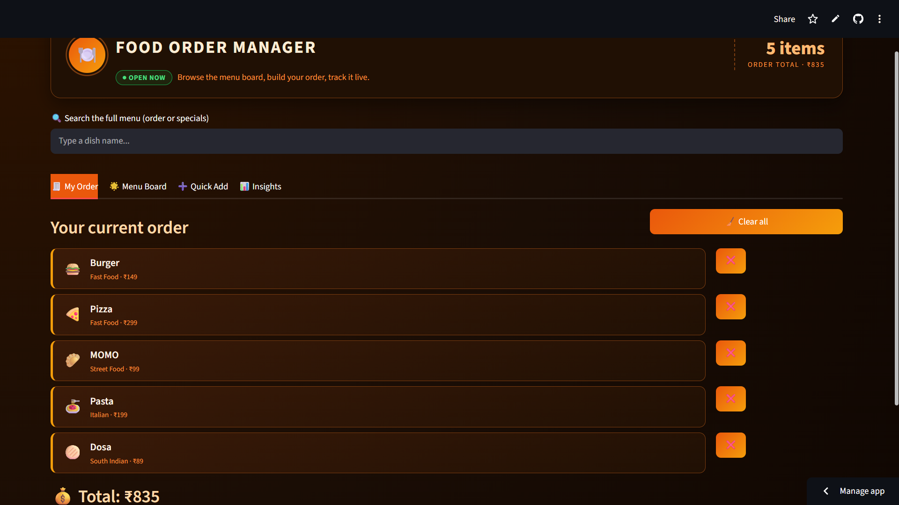
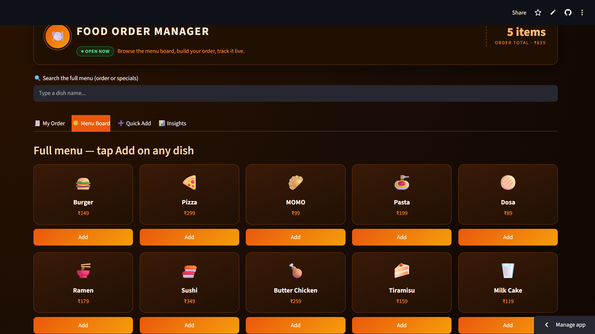
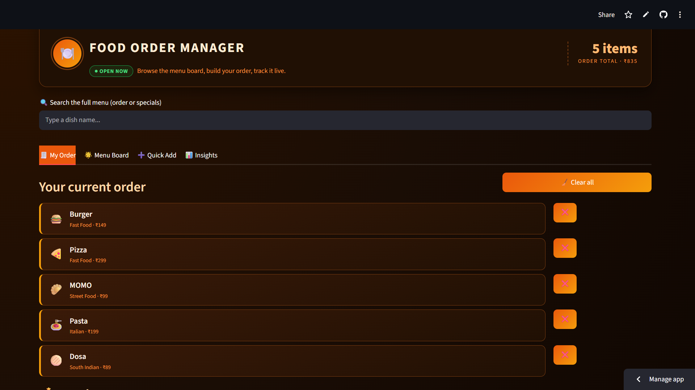
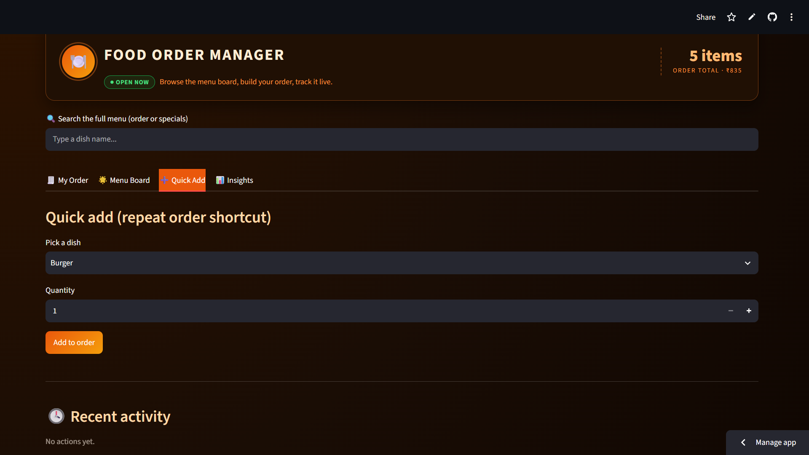
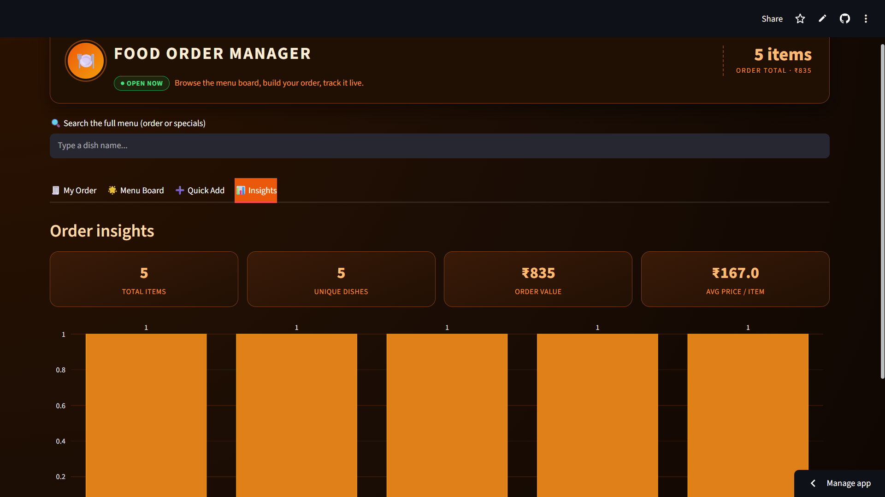

# 🍽️ Food Order Manager



[](https://www.python.org/)
[](https://interactive-food-menu.streamlit.app/)
[](https://github.com/tribhuwan-singh/food-menu-project)

An interactive restaurant menu and food ordering web application built with **Python** and **Streamlit**.

🌐 **Live Demo:** https://interactive-food-menu.streamlit.app/

---

## 📌 Project Overview

Food Order Manager is a responsive web application that allows users to browse a restaurant menu, quickly add dishes to an order, search menu items, and view order analytics in real time.

The project demonstrates practical skills in:

- Python
- Streamlit
- Session State Management
- Interactive UI Design
- Data Visualization
- Dashboard Development

---

# ✨ Features

✅ Interactive Menu Board

- Browse dishes with attractive cards
- One-click Add to Order
- Food categories and pricing

---

✅ Order Management

- Add multiple items
- Remove individual dishes
- Clear entire order
- Running order total
- Live item counter

---

✅ Smart Search

Search menu items instantly using the search bar.

---

✅ Quick Add

- Select dish from dropdown
- Choose quantity
- Add directly without browsing

---

✅ Order Insights Dashboard

Displays real-time analytics including:

- Total Items
- Unique Dishes
- Total Order Value
- Average Price per Item
- Order Distribution Chart

---

## 🖼️ Application Screenshots

### 🏠 Home


---

### 🍔 Menu Board



---

### 🛒 Current Order



---

### ⚡ Quick Add



---

### 📊 Insights Dashboard



---

## 🛠️ Technologies Used

| Technology | Purpose |
|------------|----------|
| Python | Core Programming |
| Streamlit | Web Application |
| Pandas | Data Handling |
| Plotly | Interactive Charts |
| HTML/CSS | Custom UI Styling |

---

## 📂 Project Structure

```
food-menu-project/
│
├── app.py
├── requirements.txt
├── images/
│   ├── home.png
│   ├── menu-board.png
│   ├── current-order.png
│   ├── quick-add.png
│   └── insights.png
└── README.md
```

---

## 🚀 Run Locally

Clone the repository

```bash
git clone https://github.com/tribhuwan-singh/food-menu-project.git
```

Go to project folder

```bash
cd food-menu-project
```

Install dependencies

```bash
pip install -r requirements.txt
```

Run the application

```bash
streamlit run app.py
```

---

## 🌍 Live Application

https://interactive-food-menu.streamlit.app/

---

## 🎯 Future Improvements

- User Login
- Payment Gateway
- Order History
- Database Integration
- Restaurant Admin Panel
- Dark/Light Theme Toggle
- Customer Reviews
- Delivery Tracking

---

## 👨‍💻 Author

**Tribhuwan Singh Kunwar**

🔗 LinkedIn

https://www.linkedin.com/in/tribhuwansinghkunwar/

GitHub

https://github.com/tribhuwan-singh

---

⭐ If you liked this project, don't forget to Star the repository!
